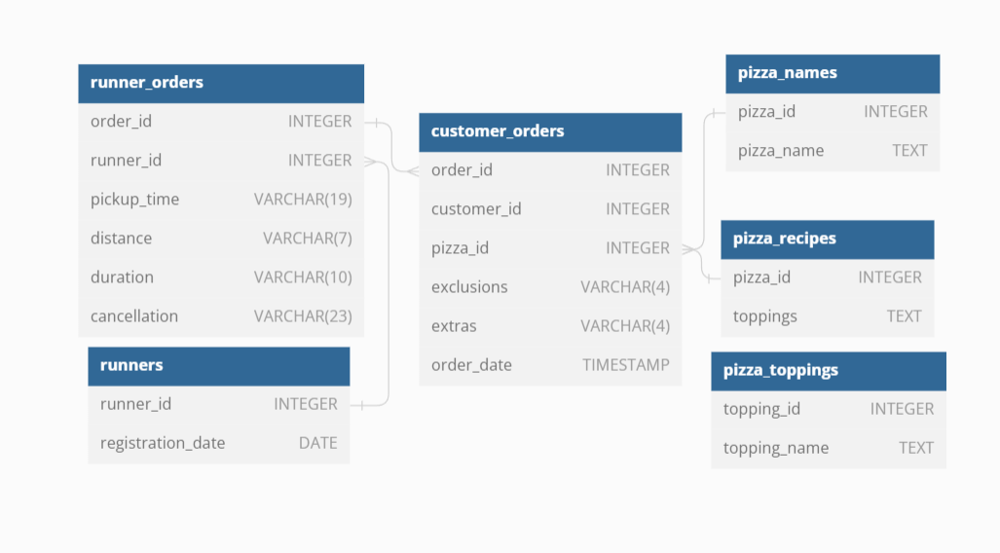

## Table Of Contents  
[ERD](#erd)  
[Pizza Metrics](#a-pizza-metrics)

### ERD  


## _REQUIREMENTS_  
## A. Pizza Metrics  
- How many pizzas were ordered?  
- How many unique customer orders were made?  
- How many successful orders were delivered by each runner?  
- How many of each type of pizza was delivered?  
- How many Vegetarian and Meatlovers were ordered by each customer?  
- What was the maximum number of pizzas delivered in a single order?  
- For each customer, how many delivered pizzas had at least 1 change and how many had no changes?  
- How many pizzas were delivered that had both exclusions and extras?  
- What was the total volume of pizzas ordered for each hour of the day?  
- What was the volume of orders for each day of the week?

## Queries
```
--   A. Pizza Metrics
-- How many pizzas were ordered?
SELECT COUNT(pizza_id) AS total_pizza
FROM customer_orders;

-- How many unique customer orders were made?
SELECT COUNT(DISTINCT order_id) AS unique_order
FROM customer_orders;

-- How many successful orders were delivered by each runner?
SELECT runner_id , COUNT( run.order_id) AS successfull
FROM runner_orders run 
WHERE pickup_time <> 'null'
GROUP BY runner_id;

-- How many of each type of pizza was delivered?
WITH orders AS (
	SELECT order_id
	FROM runner_orders run 
	WHERE pickup_time <> 'null'
), piz_id AS (
	SELECT pizza_id, COUNT(*) AS pizzas
	FROM orders JOIN customer_orders cus ON orders.order_id = cus.order_id
	GROUP BY pizza_id
)	SELECT pizza_name, pizzas
	FROM piz_id JOIN pizza_names p_name ON piz_id.pizza_id = p_name.pizza_id

-- How many Vegetarian and Meatlovers were ordered by each customer?
SELECT customer_id, pizza_name,COUNT(*) AS total_pizzas
FROM pizza_names piz JOIN customer_orders cus ON piz.pizza_id = cus.pizza_id
WHERE pizza_name = 'Vegetarian' OR pizza_name = 'Meatlovers'
GROUP BY customer_id,pizza_name;

-- What was the maximum number of pizzas delivered in a single order?
SELECT run.order_id, COUNT(*) AS total_pizzas
FROM runner_orders run 
	JOIN customer_orders cus ON run.order_id = cus.order_id
WHERE pickup_time <> 'null'
GROUP BY run.order_id
ORDER BY COUNT(*) DESC
LIMIT 1

-- For each customer, how many delivered pizzas had at least 1 change and how many had no changes?
SELECT cus.customer_id, 
SUM(CASE WHEN (
	(exclusions IS NOT NULL AND exclusions <> 'null' AND LENGTH(exclusions) > 0) 
	OR 
	(extras IS NOT NULL AND extras <> 'null' AND LENGTH(extras) > 0)) = true THEN 1 ELSE 0 END) AS changes,
SUM(CASE WHEN (
	(exclusions IS NOT NULL AND exclusions <> 'null' AND LENGTH(exclusions) > 0) 
	OR 
	(extras IS NOT NULL AND extras <> 'null' AND LENGTH(extras) > 0)) = true THEN 0 ELSE 1 END) AS no_changes
FROM runner_orders run 
	JOIN customer_orders cus ON run.order_id = cus.order_id
WHERE pickup_time <> 'null'
GROUP BY cus.customer_id

-- How many pizzas were delivered that had both exclusions and extras?
SELECT pizza_id, SUM(CASE WHEN ((exclusions IS NOT NULL AND exclusions <> 'null' AND LENGTH(exclusions) > 0) 
	AND
	(extras IS NOT NULL AND extras <> 'null' AND LENGTH(extras) > 0)) = true THEN 1 ELSE 0 END) AS both_changed
FROM runner_orders run 
	JOIN customer_orders cus ON run.order_id = cus.order_id
WHERE pickup_time <> 'null'
GROUP BY pizza_id;

-- What was the total volume of pizzas ordered for each hour of the day?
SELECT EXTRACT(HOUR FROM order_time) AS hour, COUNT(*) AS total_pizzas
FROM customer_orders 
GROUP BY 1;

-- What was the volume of orders for each day of the week? 
SELECT DATE_PART('dow',order_time) AS day, to_char(order_time, 'Dy') AS day_name, COUNT(*) AS total_orders
FROM customer_orders 
GROUP BY 1,2;
```
